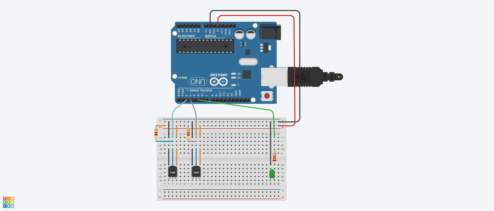
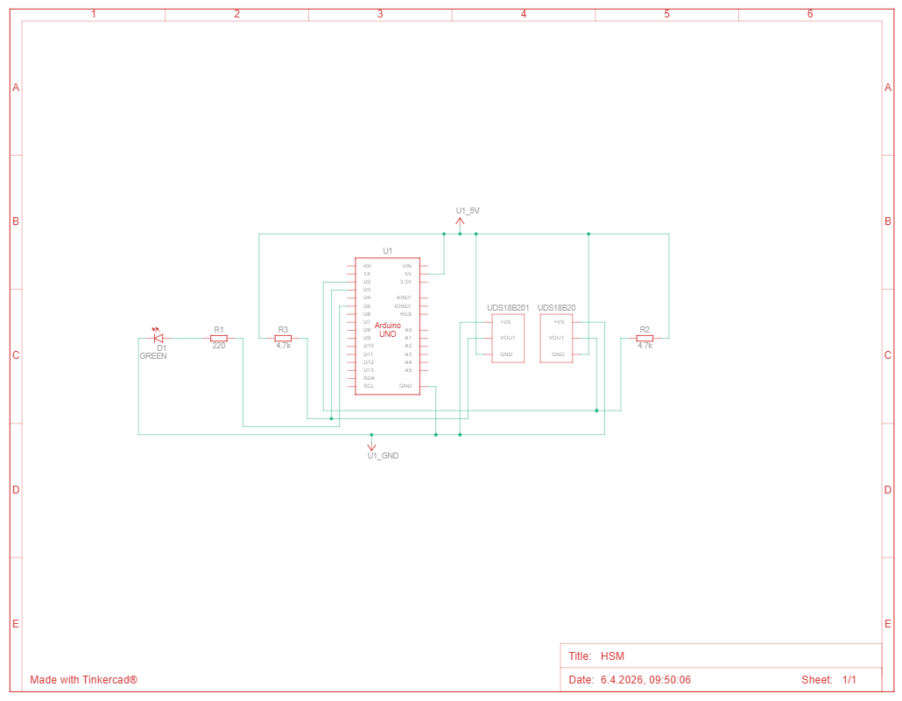

# HSM - Heating System Monitoring

for Arduino Uno with DS18B20 temperature sensors
- Version 1.6
- Created: April 2026

Install the Libraries in Arduino IDE:
- TemperatureControl (Downloaded from https://github.com/PaulStoffregen/OneWire/releases -> 2.3.3 -> zipfile)
- OneWire (Downloaded form https://github.com/milesburton/Arduino-Temperature-Control-Library/releases -> 3.7.6 -> zipfile)

Features:
- Supports Two 1-Wire Buses for temperature measurement.
- Data is sent to server via REST JSON Request.

Time measurement is done by counting loops, which is not that accurate.

Update V 1.4: 
- Includes a water leak detection

Update V 1.5: 
- Includes a second water leak detection 

Update V 1.6: 
- Removed bulk data collection, adapted to new REST Service 

# Technical Solution

## Arduino Parts
A number of parts are required in order to setup the arduino. Please find below a list of components with a link of a possible shop. 

<table>
	<tr>
		<th>Quantity</th>
		<th>Product</th>
		<th>Possible Shop URL</th>
		<th>Price</th>
	</tr>
	<tr>
		<td>1</td>
		<td>Arduino UNO Rev3</td>
		<td><a href="http://store.arduino.cc/index.php?main_page=product_info&cPath=11&products_id=195">Arduino.cc</a></td>
		<td>EUR 23,80</td>
	</tr>
	<tr>
		<td>1</td>
		<td>Arduino Ethernet Shield Rev3</td>
		<td><a href="http://store.arduino.cc/index.php?main_page=product_info&cPath=37_5&products_id=199">Arduino.cc</a></td>
		<td>EUR 34,51</td>
	</tr>	
	<tr>
		<td>10</td>
		<td>1m Waterproof Digital Thermal Temperature Temp Sensor Probe DS18B20 Connector</td>
		<td><a href="http://r.ebay.com/oJ5Xta">sureelectronics (Ebay)</a></td>
		<td>EUR 13,72</td>
	</tr>
	<tr>
		<td>5</td>
		<td>5m Waterproof Digital Thermal Temperature Temp Sensor Probe DS18B20 Connector</td>
		<td><a href="http://r.ebay.com/ZWwbxL">sureelectronics (Ebay)</a></td>
		<td>EUR 18,69</td>
	</tr>
	<tr>
		<td>1</td>
		<td>Breadboard</td>		
		<td><a href="http://www.amazon.de/dp/B009P04XG8">Amazon Shop</a></td>
		<td>EUR 2,67</td>
	</tr>
	<tr>
		<td>1</td>
		<td>9V Netzteil</td>
		<td><a href="http://www.amazon.de/dp/B008QXOMQQ">Amazon Shop</a></td>
		<td>EUR 9,99</td>
	</tr>
	<tr>
		<td>1</td>
		<td>Male Header Pins (Height: 19.8mm)</td>		
		<td><a href="http://www.conrad.de/ce/de/product/741133/Stiftleiste-RM-254-gerade-Pole-1-x-36-10120510-BKL-Electronic-Inhalt-1-St">Conrad</a></td>
		<td>few cents</td>
	</tr>
	<tr>
		<td>1</td>
		<td>220 Ohm Resistor</td>		
		<td>&nbsp;</td>
		<td>few cents</td>
	</tr>
	<tr>
		<td>2</td>
		<td>4.7 kOhm Resistor</td>		
		<td>&nbsp;</td>
		<td>few cents</td>
	</tr>	
	<tr>
		<td>1</td>
		<td>LEDs, any color</td>		
		<td>&nbsp;</td>
		<td>few cents</td>
	</tr>	
	<tr>
		<td colspan="3" align="right">Total without shipping</td>
		<td>ca. EUR 100,00</td>
	</tr>		
</table>

# Arduino Board Setup
As the arduino uno does not have a possibility to connect to the internet, an ethernet shield is required. The ethernet shield is not shown in the next diagram.

The temperature sensors are connected using the 1-Wire bus protocol. There are actually two busses installed. The reason is that some temperature sensors required a long cable (up to 10 meters). It seems like the power of the arduino is limited and only a sum of temperature sensors cable length of about 25 meters is possible to be connected to the bus. Therefore the board supports two busses in order to handle longer cable length. 

